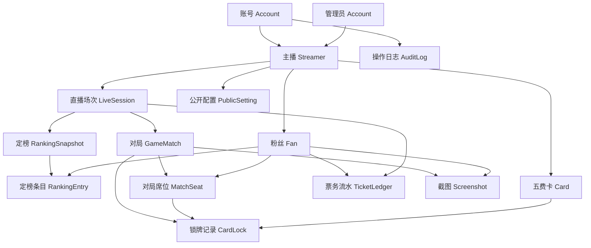

# 02-数据模型设计

整理时间：2026-06-18

## 设计目标

新项目的数据模型要服务三个核心流程：

- 直播场次中多次定榜、多局游戏和结算。
- 粉丝长期资料、状态、存票余额和本场票务变化。
- 锁牌、截图、公开展示和操作日志的可追溯管理。

第一版应按可部署系统设计，数据保存在后端数据库中，截图保存在对象存储或服务器文件存储中。不要复用旧项目的浏览器本地存储模型。

## 核心实体关系

## 实体清单

### Account 账号

用途：管理员和主播登录。粉丝不注册、不登录。

建议字段：

- `id`
- `role`：`admin` / `streamer`
- `streamerId`：主播账号关联自己的主播资料；管理员可为空
- `username`
- `passwordHash`
- `displayName`
- `status`：正常、停用
- `activeSessionId`：用于单账号单设备在线
- `lastLoginAt`
- `createdAt`
- `updatedAt`

### Streamer 主播

用途：承载主播空间，未来预留多主播。

建议字段：

- `id`
- `name`
- `douyinName`
- `note`
- `status`
- `defaultRuleTemplateId`
- `createdAt`
- `updatedAt`

### Fan 粉丝

用途：长期粉丝资料和身份绑定。游戏名不是核心身份，只作为资料或备注。

建议字段：

- `id`
- `streamerId`
- `displayName`
- `douyinName`
- `wechatName`
- `gameName`
- `fanGroupLevel`
- `statuses`：多状态，例如新粉、老粉、管理、违规、拉黑
- `isPublicInBalanceBoard`
- `publicName`
- `note`
- `createdAt`
- `updatedAt`

规则：

- 拉黑后禁止参赛，但历史数据保留。
- 拉黑/解除拉黑建议必须填写原因并记录日志。
- 新粉完成一局后可自动转老粉，也支持手动标记。

### Card 五费卡

用途：赛季卡池和锁牌。

建议字段：

- `id`
- `streamerId`
- `seasonId`
- `name`
- `alias`
- `category`
- `tags`
- `note`
- `isEnabled`

### Season 赛季

建议字段：

- `id`
- `name`
- `gameVersion`
- `startedAt`
- `endedAt`
- `note`

### RuleTemplate 规则模板

用途：承载两种名单生成风格和默认名额。

建议字段：

- `id`
- `streamerId`
- `name`
- `mode`：`rank7_candidates` / `rank5_then_extend`
- `oldFanSlots`
- `newFanSlots`
- `requiresEightPlayers`
- `allowCasualMode`
- `note`

默认模板：

- 定榜七候选：先录榜 7，根据新粉数量确定上车和待定。
- 定榜五顺延：先录榜 5，没新粉时顺延老粉补位。

### LiveSession 直播场次

用途：下午场/晚上场，一场直播包含多次定榜和多局游戏。

建议字段：

- `id`
- `streamerId`
- `title`
- `sessionType`：下午场、晚上场、自定义
- `ruleTemplateId`
- `status`：准备中、进行中、待结算、已结算、取消
- `startedAt`
- `endedAt`
- `settledAt`
- `settlementConfirmedBy`
- `note`

### RankingSnapshot 定榜

用途：一次定榜动作，基于本场累计榜，但每次可以调整票务。

建议字段：

- `id`
- `sessionId`
- `title`
- `roundNo`
- `style`：定榜七候选 / 定榜五顺延 / 手动
- `status`：草稿、已确认、已用于生成名单
- `screenshotId`
- `note`
- `createdAt`

### RankingEntry 定榜条目

用途：记录榜单中的人、票数和上车状态。

建议字段：

- `id`
- `rankingSnapshotId`
- `fanId`
- `displayNameAtTime`
- `douyinNameAtTime`
- `rankOrder`
- `giftDiamonds`
- `ticketUsed`
- `manualAdjustment`
- `competitionScore`
- `fanTypeAtTime`：老粉、新粉、未知
- `seatDecision`：上车、待定、等下一把、放弃、未使用
- `note`

计算建议：

- `competitionScore = giftDiamonds + ticketUsed + manualAdjustment`
- 计算结果允许人工调整和备注。

### GameMatch 对局

用途：一局游戏，规则水友赛要 8 人；无规则模式可以不锁牌、不强制 8 人。

建议字段：

- `id`
- `sessionId`
- `rankingSnapshotId`
- `matchNo`
- `mode`：规则水友赛 / 无规则模式
- `seasonId`
- `status`：准备中、进行中、已结束、作废
- `startedAt`
- `endedAt`
- `note`

### MatchSeat 对局席位

用途：记录本局每个席位的人和当局展示信息。

建议字段：

- `id`
- `matchId`
- `seatNo`
- `fanId`
- `seatType`：主播、老粉、新粉、补位、小号/多开、手动
- `gameNameAtTime`
- `status`：存活、淘汰、退出
- `eliminatedAt`
- `finalRank`
- `note`

### CardLock 锁牌记录

用途：记录每个席位当前/历史锁牌。

建议字段：

- `id`
- `matchId`
- `seatId`
- `cardId`
- `action`：锁定、取消、释放、备注
- `isActiveOccupy`
- `createdAt`
- `note`

规则：

- 存活玩家锁牌互斥占用。
- 淘汰玩家保留记录，但不继续占用可用池。

### TicketLedger 票务流水

用途：所有存票、取票、修正、回退、作废都走流水。

建议字段：

- `id`
- `streamerId`
- `fanId`
- `sessionId`
- `rankingSnapshotId`
- `type`：存票、取票、现刷、修正、回退、作废
- `amount`
- `affectsBalance`
- `affectsCompetition`
- `status`：正常、作废
- `voidedBy`
- `voidedAt`
- `note`
- `createdBy`
- `createdAt`

规则：

- 存票余额长期保存。
- 本场新增存票直播中先预览，直播结束结算确认后入账。
- 修改存票用修正记录，不直接覆盖原始记录。
- 删除用软删除/作废，不物理删除。

### Screenshot 截图

用途：截图上传、证据、精彩画面、定榜截图。

建议字段：

- `id`
- `streamerId`
- `sessionId`
- `matchId`
- `fanId`
- `type`：定榜、精彩、违规、其他
- `storageKey`
- `originalName`
- `mimeType`
- `sizeBytes`
- `isPublic`
- `status`：正常、已删除
- `deletedAt`
- `note`
- `createdBy`
- `createdAt`

规则：

- 默认不公开。
- 精彩和违规截图都可以公开，是否展示只看公开状态。
- MVP 推荐单张 5MB。
- 允许删除没用或错误图片。

### PublicSetting 公开配置

用途：游客公开页模块级开关。

建议字段：

- `id`
- `streamerId`
- `module`：存票榜、截图墙、对局历史、说明
- `isEnabled`
- `visibleFields`
- `filterableFields`
- `note`

规则：

- 游客只能按公开字段筛选。
- 抖音名没公开，就不能按抖音名搜索。

### AuditLog 操作日志

用途：追踪管理员和主播关键操作。

建议字段：

- `id`
- `actorAccountId`
- `actorRole`
- `streamerId`
- `action`
- `targetType`
- `targetId`
- `beforeJson`
- `afterJson`
- `note`
- `createdAt`

必须记录：

- 存票、取票、修正、作废、结算。
- 拉黑、解除拉黑、状态变更。
- 公开设置变化。
- 管理员代操作。
- 截图删除。

## 余额与结算建议

粉丝存票余额不建议作为唯一真值直接手改。推荐：

- 以 `TicketLedger` 流水为真值。
- 可以维护一个缓存余额字段提高查询速度。
- 每次流水变化后重算或增量更新缓存。
- 结算时生成一批确认后的入账/回退流水。

这样可以减少“算错了找不到原因”的风险。

