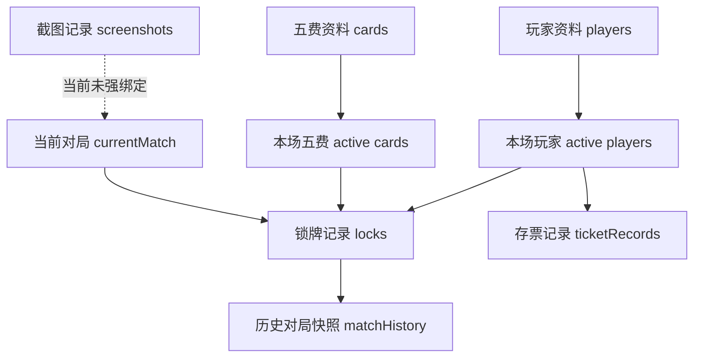

# 03-业务流程与数据关系

整理时间：2026-06-16

## 主要业务流程

### 资料准备流程

```text
录入玩家资料
  -> 录入五费卡资料
  -> 标记五费分类、赛季、标签
  -> 在本场配置中选择本局参与玩家和五费卡
  -> 进入锁牌记录
```

关键点：

- 基础资料是长期资料库。
- 本场配置是当前对局使用的临时选择。
- 锁牌管理只应使用本场已选择的玩家和五费卡。

### 锁牌流程

```text
开始新对局
  -> 配置本场玩家
  -> 配置本场五费卡
  -> 玩家选择锁定五费
  -> 存活玩家之间互斥占用五费
  -> 玩家淘汰
  -> 淘汰玩家保留锁牌记录
  -> 根据淘汰顺序计算排名
  -> 保存当前对局快照
```

关键规则：

- 存活玩家选择的五费会占用可用池。
- 淘汰玩家的五费记录继续保存。
- 淘汰玩家的五费不应影响存活玩家继续选择。
- 淘汰排名按淘汰时间和玩家顺序计算。

### 存票流程

```text
选择玩家
  -> 记录存票或取票
  -> 填写数量和备注
  -> 形成流水
  -> 按余额动态排序
```

当前规则很简单，只适合表达“某个玩家当前存了多少票”。

真实业务中还存在：

- 一场直播多局游戏。
- 每局定榜。
- 新粉名额。
- 无新粉顺延。
- 场次结束结算。

这些还没有在旧项目中落地。

### 截图流程

```text
上传截图
  -> 填写玩家、标签、备注
  -> 保存到浏览器本地
  -> 搜索或删除
```

当前截图记录是独立模块，没有和当前对局或历史对局建立强关系。

## 当前核心数据关系

### 玩家

玩家资料字段：

- `id`
- `nickname`
- `douyinName`
- `wechatName`
- `gameName`
- `active`
- `note`

关系：

- `active` 表示是否属于当前本场配置。
- 锁牌记录通过 `playerId` 关联玩家。
- 存票记录通过 `playerId` 关联玩家。

### 五费卡

五费卡资料字段：

- `id`
- `name`
- `alias`
- `category`
- `season`
- `active`
- `tags`
- `note`

关系：

- `category` 用于区分正常五费、解锁五费、可选五费。
- `season` 用于按赛季配置。
- `tags` 用于补充标记，例如新春使者。
- `active` 表示是否属于当前本场配置。
- 锁牌记录通过 `cardIds` 关联五费卡。

### 锁牌记录

锁牌字段：

- `playerId`
- `status`
- `eliminatedAt`
- `cardIds`
- `note`

关系：

- 一个玩家对应一条锁牌记录。
- `cardIds` 是该玩家当前锁定的五费卡。
- `status` 为淘汰时，记录仍保留。
- `eliminatedAt` 用于计算淘汰排名。

### 当前对局

当前对局字段：

- `name`
- `startedAt`
- `season`

关系：

- 表达当前正在操作的对局。
- 与本场玩家、本场五费、锁牌记录共同组成当前局状态。

### 历史对局

历史快照字段：

- `id`
- `name`
- `createdAt`
- `startedAt`
- `season`
- `playerIds`
- `cardIds`
- `locks`

关系：

- 保存某一刻的当前对局配置和锁牌状态。
- 可恢复玩家、五费、当前对局信息和锁牌记录。
- 当前不包含截图和存票记录。

### 存票记录

存票字段：

- `id`
- `playerId`
- `type`
- `amount`
- `note`
- `createdAt`

关系：

- 通过 `playerId` 关联玩家。
- 余额由流水动态计算。
- 当前没有场次、局次、定榜和结算概念。

## 数据关系图



## 当前数据边界问题

- 基础资料和本场配置都通过 `active` 字段表达，语义比较挤。
- 当前对局、本场配置、锁牌记录是不同概念，但在代码中耦合较强。
- 历史对局是快照，不是完整事件流。
- 存票记录和对局、直播场次没有关系。
- 截图记录和对局没有关系。

